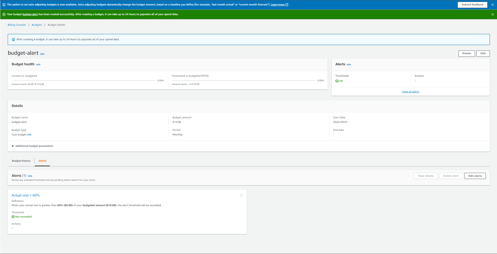
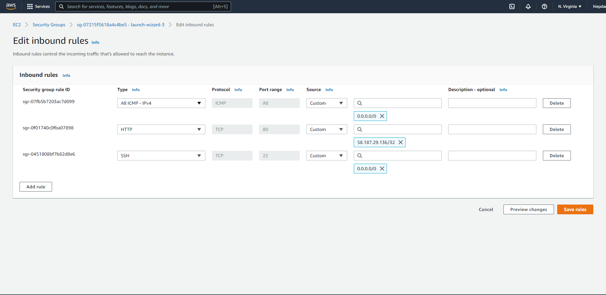
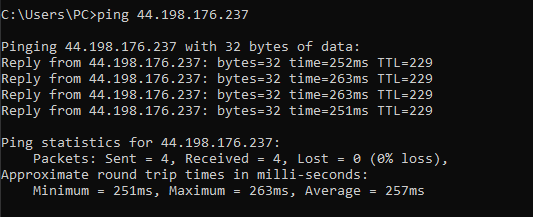
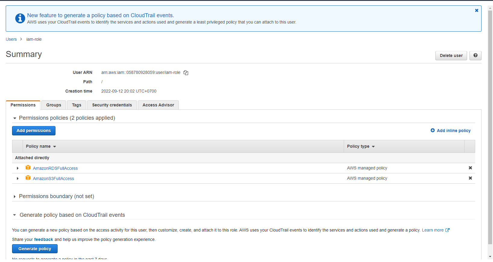
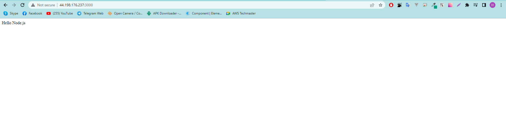

# Kiểm tra thực hành tại lớp

# Phần 1: Trắc nghiệm

1: A  
2: A,B  
3: B  
4: A  
5: A  
6: A,B  
7: C  
8: A,E  
9: B  
10: D  
11: B  
12: A  
13: B  
14: C  
15: B,E  
16: A,B,D  
17: B

# Phần 2: Thực hành

#1: Budget Alert

#2: Ping to EC2

#3: Create IAM Role

#4: Deploy Node.js app

#Link deploy  
http://44.198.176.237:3000/
